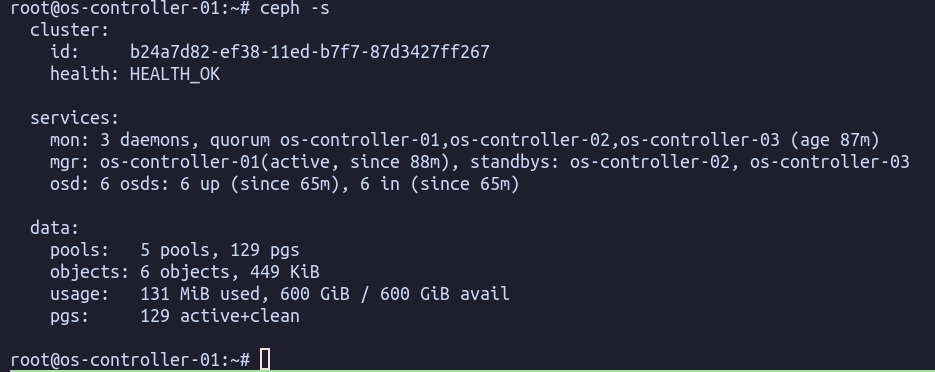

# Manual Deployment Ceph Quincy Cluster

## Environment

```html
ceph mon : os-controller-01, os-controller-02, os-controller-03
ceph mgr : os-controller-01, os-controller-02, os-controller-03
ceph osd : os-compute-01, os-compute-03, os-compute-03
ceph osd disk : /dev/sdb, /dev/sdc
ceph public network = 10.30.30.0/24
ceph cluster network =  10.40.40.0/24
```

## Install ceph on all node

```bash
sudo apt install -y ceph
```

## Setting Up the Ceph Configuration **(Exec on controller-1 only )**

1. Create ceph configuration file

```html
sudo apt install -y uuid
FSID=$(uuid)
	
cat<<EOF | sudo tee /etc/ceph/ceph.conf
[global]
fsid = ${FSID}
mon initial members = os-controller-01, os-controller-02, os-controller-03
mon host = 10.30.30.11, 10.30.30.12, 10.30.30.13
public_network = 10.30.30.0/24
cluster_network =  10.40.40.0/24
auth cluster required = cephx
auth service required = cephx
auth client required = cephx
EOF
	
# Distribusikan ceph.conf
scp /etc/ceph/ceph.conf os-controller-01:/etc/ceph/ceph.conf
scp /etc/ceph/ceph.conf os-controller-02:/etc/ceph/ceph.conf
scp /etc/ceph/ceph.conf os-controller-03:/etc/ceph/ceph.conf
scp /etc/ceph/ceph.conf os-compute-01:/etc/ceph/ceph.conf
scp /etc/ceph/ceph.conf os-compute-02:/etc/ceph/ceph.conf
scp /etc/ceph/ceph.conf os-compute-03:/etc/ceph/ceph.conf
```

2. Create a ceph-mon keyring

```html
sudo ceph-authtool \\
  --create-keyring /tmp/ceph.mon.keyring \\
  --gen-key -n mon. --cap mon 'allow *'
```

3. Create a admin keyring

```html
sudo ceph-authtool \\
  --create-keyring /etc/ceph/ceph.client.admin.keyring \\
  --gen-key -n client.admin \\
  --cap mon 'allow *' \\
  --cap osd 'allow *' \\
  --cap mds 'allow *' \\
  --cap mgr 'allow *'
```

4. Create a bootstrap-osd keyring

```html
sudo ceph-authtool \\
  --create-keyring /var/lib/ceph/bootstrap-osd/ceph.keyring \\
  --gen-key -n client.bootstrap-osd \\
  --cap mon 'profile bootstrap-osd' \\
  --cap mgr 'allow r'
```

5. Add the pre-built keyring to the ceph.mon.keyring file

```html
sudo ceph-authtool /tmp/ceph.mon.keyring \\
  --import-keyring /etc/ceph/ceph.client.admin.keyring
sudo ceph-authtool /tmp/ceph.mon.keyring \\
  --import-keyring /var/lib/ceph/bootstrap-osd/ceph.keyring
```

6. Change owner keyring

```bash
chown ceph:ceph /tmp/ceph.mon.keyring
```

7. Create a monitor map

```html
monmaptool --create \\
  --add os-controller-01 10.30.30.11 \\
  --fsid ${FSID} /tmp/monmap

monmaptool \\
  --add os-controller-02 10.30.30.12 \\
  --fsid ${FSID} /tmp/monmap

monmaptool \\
  --add os-controller-03 10.30.30.13 \\
  --fsid ${FSID} /tmp/monmap
```

8. Distribute client.admin, ceph-mon keyring, and monmap to other mon nodes

```html
sudo cp /etc/ceph/ceph.client.admin.keyring /tmp/ceph.client.admin.keyring
sudo chown $USER:$USER /tmp/{ceph.client.admin.keyring,ceph.mon.keyring,monmap}

scp /tmp/{ceph.client.admin.keyring,ceph.mon.keyring,monmap} os-controller-02:/tmp
scp /tmp/{ceph.client.admin.keyring,ceph.mon.keyring,monmap} os-controller-03:/tmp

ssh os-controller-02 mv /tmp/ceph.client.admin.keyring /etc/ceph/
ssh os-controller-03 mv /tmp/ceph.client.admin.keyring /etc/ceph/
```

9. Distribute bootstrap-osd keyring to compute nodes

```
scp /var/lib/ceph/bootstrap-osd/ceph.keyring os-compute-01:/var/lib/ceph/bootstrap-osd/ceph.keyring 
scp /var/lib/ceph/bootstrap-osd/ceph.keyring os-compute-02:/var/lib/ceph/bootstrap-osd/ceph.keyring 
scp /var/lib/ceph/bootstrap-osd/ceph.keyring os-compute-03:/var/lib/ceph/bootstrap-osd/ceph.keyring 
ssh -n os-compute-01 chown ceph:ceph /var/lib/ceph/bootstrap-osd/ceph.keyring
ssh -n os-compute-02 chown ceph:ceph /var/lib/ceph/bootstrap-osd/ceph.keyring
ssh -n os-compute-03 chown ceph:ceph /var/lib/ceph/bootstrap-osd/ceph.keyring
```

## Create ceph-mon service (Exec on all controller nodes)

1. Create a ceph-mon directory

```html
sudo -u ceph mkdir /var/lib/ceph/mon/ceph-$(hostname)
```

2. Initiate ceph-mon

```html
sudo chown ceph:ceph /tmp/ceph.mon.keyring
sudo -u ceph ceph-mon --mkfs -i $(hostname) --monmap /tmp/monmap --keyring /tmp/ceph.mon.keyring
```

3. Enable and run the ceph-mon service

```html
sudo systemctl enable --now ceph-mon@$(hostname)
sudo systemctl status ceph-mon@$(hostname)
```

4. Check cluster status

```html
sudo ceph -s
```

## Set up Ceph-mgr (Exec on all controller nodes)

1. Create a keyring for ceph-mgr

```html
sudo mkdir -p /var/lib/ceph/mgr/ceph-$(hostname)
sudo ceph auth get-or-create mgr.$(hostname) mon 'allow profile mgr' osd 'allow *' mds 'allow *' \\
  -o /var/lib/ceph/mgr/ceph-$(hostname)/keyring
```

2. Change directory ownership

```html
sudo chown -R ceph:ceph /var/lib/ceph/mgr
```

3. Enable and start the service

```html
sudo systemctl enable --now ceph-mgr@$(hostname)
sudo systemctl status ceph-mgr@$(hostname)
```

4. Check cluster status

```html
sudo ceph -s
```

5. Enable the msgr2 module, only needs to be done on one of the nodes.

```html
ceph mon enable-msgr2
```

## Setup the Ceph-OSD (Exec on all compute nodes)

1. Create a ceph-osd

```html
sudo ceph-volume lvm create --bluestore --data /dev/vdb
sudo ceph-volume lvm create --bluestore --data /dev/vdc
```

## **Remove W**arning insecure global\_id reclaim

1. Disable insecure global\_id reclaim feature

```html
ceph config set mon auth_expose_insecure_global_id_reclaim false
ceph config set mon auth_allow_insecure_global_id_reclaim false
```

## Result

1. Ceph status

<figure><figcaption></figcaption></figure>

2. Ceph osd tree

<figure><figcaption></figcaption></figure>

Ref:

[https://blog.ajiarya.id/posts/ceph/cara-deploy-ceph-secara-manual/](https://blog.ajiarya.id/posts/ceph/cara-deploy-ceph-secara-manual/)

[https://docs.ceph.com/en/quincy/](https://docs.ceph.com/en/quincy/)
