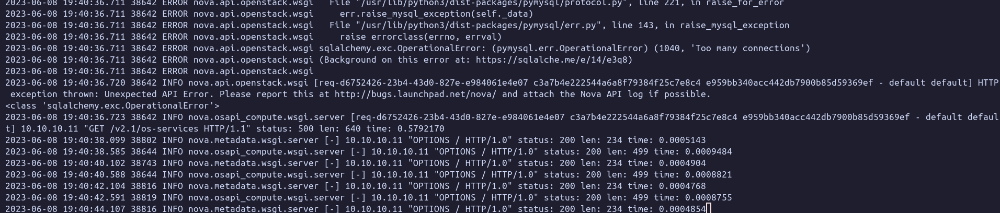

# Tshoot: Too many connection mariadb

<figure><figcaption></figcaption></figure>

**Cause:** mysql has a max\_connection variable where connections to mysql cannot exceed the value of the variable.

**Solution:** increase the value of the max\_connection variable

1. Check max\_connections configured

```bash
mysql

MariaDB [(none)]> show variables like "%connection%";
+---------------------------+--------------------+
| Variable_name             | Value              |                                                                                                                                            +---------------------------+--------------------+                                                                                                                                            | character_set_connection  | utf8mb4            |
| collation_connection      | utf8mb4_general_ci |                                                                                                                                            | default_master_connection |                    |
| extra_max_connections     | 1                  |
| max_connections           | 151                |
| max_user_connections      | 0                  |
+---------------------------+--------------------+
```

2. Check max used connections and connection error:

```bash
MariaDB [(none)]> show global status like "%connections%";                                                                                                                                    +-----------------------------------+-------+
| Variable_name                     | Value |
+-----------------------------------+-------+
| Connection_errors_max_connections | 64    |                                                                                                                                                 | Connections                       | 6613  |
| Max_used_connections              | 152   |
| Slave_connections                 | 0     |
| wsrep_open_connections            | 0     |                                                                                                                                                 +-----------------------------------+-------+
```

3. Increase max connection

```bash
MariaDB [(none)]> SET GLOBAL max_connections=4096;
Query OK, 0 rows affected (0.000 sec)
```

4. Check again

```bash
MariaDB [(none)]> show variables like "%connection%";
+---------------------------+--------------------+                                                                                                                                            | Variable_name             | Value              |                                                                                                                                            +---------------------------+--------------------+
| character_set_connection  | utf8mb4            |                                                                                                                                            | collation_connection      | utf8mb4_general_ci |
| default_master_connection |                    |
| extra_max_connections     | 1                  |
| max_connections           | 4096               |
| max_user_connections      | 0                  |
+---------------------------+--------------------+
```
