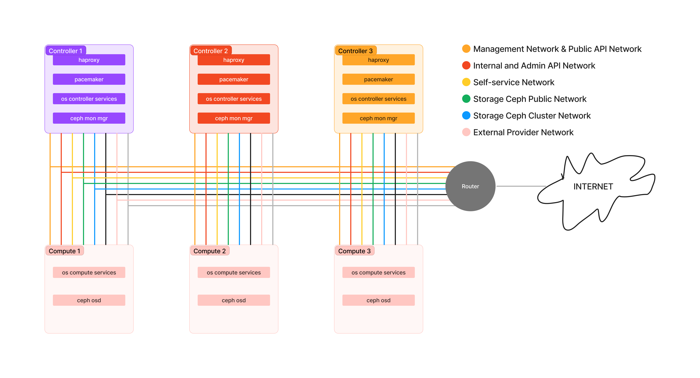

# Deployment Topology Scenario


## Toplogy

<figure><figcaption></figcaption></figure>

## Version

```
Openstack: Yoga
Ceph: Quincy
```

## Endpoint

```html
Region Name : java
Domain : dama.id
Internal vip hostname : internal.java.dama.id
Admin vip hostname : admin.java.dama.id
Public vip hostname : public.java.dama.id
Internal VIP : 10.10.10.100
External VIP : 202.10.10.100
Horizon :	202.10.10.100/horizon
```

## Network Mapping

| Interface Name | Role                                    | CIDR           |
| -------------- | --------------------------------------- | -------------- |
| ens3           | Management Network & Public API Network | 202.10.10.0/24 |
| ens4           | Internal and Admin API Network          | 10.10.10.0/24  |
| ens5           | Self-service Network (Geneve Tunneling) | 10.20.20.0/24  |
| ens6           | Storage Ceph Public Network             | 10.30.30.0/24  |
| ens7           | Storage Ceph Cluster Network            | 10.40.40.0/24  |
| ens8           | External Provider Network               | 50.50.50.0/24  |
| ens9           | External Provider Network               | 60.60.60.0/24  |


## **VM Environment**

```
[VM1]
NAME: os-controller-01
OS: ubuntu-focal
NESTED-VIRTUALIZATION: y
VCPUS: 8
MEMORY: 16G
DISK1: 25G
IFACE_NETWORK1: 202.10.10.0
IFACE_IP1: 202.10.10.11
IFACE_NETWORK2: 10.10.10.0
IFACE_IP2: 10.10.10.11
IFACE_NETWORK3: 10.20.20.0
IFACE_IP3: 10.20.20.11
IFACE_NETWORK4: 10.30.30.0
IFACE_IP4: 10.30.30.11
IFACE_NETWORK5: 10.40.40.0
IFACE_IP5: 10.40.40.11
IFACE_NETWORK6: 50.50.50.0
IFACE_IP6: none
IFACE_NETWORK7: 60.60.60.0
IFACE_IP7: none
CONSOLE: vnc

[VM2]
NAME: os-controller-02
OS: ubuntu-focal
NESTED-VIRTUALIZATION: y
VCPUS: 8
MEMORY: 16G
DISK1: 25G
IFACE_NETWORK1: 202.10.10.0
IFACE_IP1: 202.10.10.12
IFACE_NETWORK2: 10.10.10.0
IFACE_IP2: 10.10.10.12
IFACE_NETWORK3: 10.20.20.0
IFACE_IP3: 10.20.20.12
IFACE_NETWORK4: 10.30.30.0
IFACE_IP4: 10.30.30.12
IFACE_NETWORK5: 10.40.40.0
IFACE_IP5: 10.40.40.12
IFACE_NETWORK6: 50.50.50.0
IFACE_IP6: none
IFACE_NETWORK7: 60.60.60.0
IFACE_IP7: none
CONSOLE: vnc

[VM3]
NAME: os-controller-03
OS: ubuntu-focal
NESTED-VIRTUALIZATION: y
VCPUS: 8
MEMORY: 16G
DISK1: 25G
IFACE_NETWORK1: 202.10.10.0
IFACE_IP1: 202.10.10.13
IFACE_NETWORK2: 10.10.10.0
IFACE_IP2: 10.10.10.13
IFACE_NETWORK3: 10.20.20.0
IFACE_IP3: 10.20.20.13
IFACE_NETWORK4: 10.30.30.0
IFACE_IP4: 10.30.30.13
IFACE_NETWORK5: 10.40.40.0
IFACE_IP5: 10.40.40.13
IFACE_NETWORK6: 50.50.50.0
IFACE_IP6: none
IFACE_NETWORK7: 60.60.60.0
IFACE_IP7: none
CONSOLE: vnc

[VM4]
NAME: os-compute-01
OS: ubuntu-focal
NESTED-VIRTUALIZATION: y
VCPUS: 8
MEMORY: 16G
DISK1: 25G
DISK2: 50G
DISK3: 50G
IFACE_NETWORK1: 202.10.10.0
IFACE_IP1: 202.10.10.21
IFACE_NETWORK2: 10.10.10.0
IFACE_IP2: 10.10.10.21
IFACE_NETWORK3: 10.20.20.0
IFACE_IP3: 10.20.20.21
IFACE_NETWORK4: 10.30.30.0
IFACE_IP4: 10.30.30.21
IFACE_NETWORK5: 10.40.40.0
IFACE_IP5: 10.40.40.21
IFACE_NETWORK6: 50.50.50.0
IFACE_IP6: none
IFACE_NETWORK7: 60.60.60.0
IFACE_IP7: none
CONSOLE: vnc

[VM5]
NAME: os-compute-02
OS: ubuntu-focal
NESTED-VIRTUALIZATION: y
VCPUS: 8
MEMORY: 16G
DISK1: 25G
DISK2: 50G
DISK3: 50G
IFACE_NETWORK1: 202.10.10.0
IFACE_IP1: 202.10.10.22
IFACE_NETWORK2: 10.10.10.0
IFACE_IP2: 10.10.10.22
IFACE_NETWORK3: 10.20.20.0
IFACE_IP3: 10.20.20.22
IFACE_NETWORK4: 10.30.30.0
IFACE_IP4: 10.30.30.22
IFACE_NETWORK5: 10.40.40.0
IFACE_IP5: 10.40.40.22
IFACE_NETWORK6: 50.50.50.0
IFACE_IP6: none
IFACE_NETWORK7: 60.60.60.0
IFACE_IP7: none
CONSOLE: vnc

[VM6]
NAME: os-compute-03
OS: ubuntu-focal
NESTED-VIRTUALIZATION: y
VCPUS: 8
MEMORY: 16G
DISK1: 25G
DISK2: 50G
DISK3: 50G
IFACE_NETWORK1: 202.10.10.0
IFACE_IP1: 202.10.10.23
IFACE_NETWORK2: 10.10.10.0
IFACE_IP2: 10.10.10.23
IFACE_NETWORK3: 10.20.20.0
IFACE_IP3: 10.20.20.23
IFACE_NETWORK4: 10.30.30.0
IFACE_IP4: 10.30.30.23
IFACE_NETWORK5: 10.40.40.0
IFACE_IP5: 10.40.40.23
IFACE_NETWORK6: 50.50.50.0
IFACE_IP6: none
IFACE_NETWORK7: 60.60.60.0
IFACE_IP7: none
CONSOLE: vnc

```

